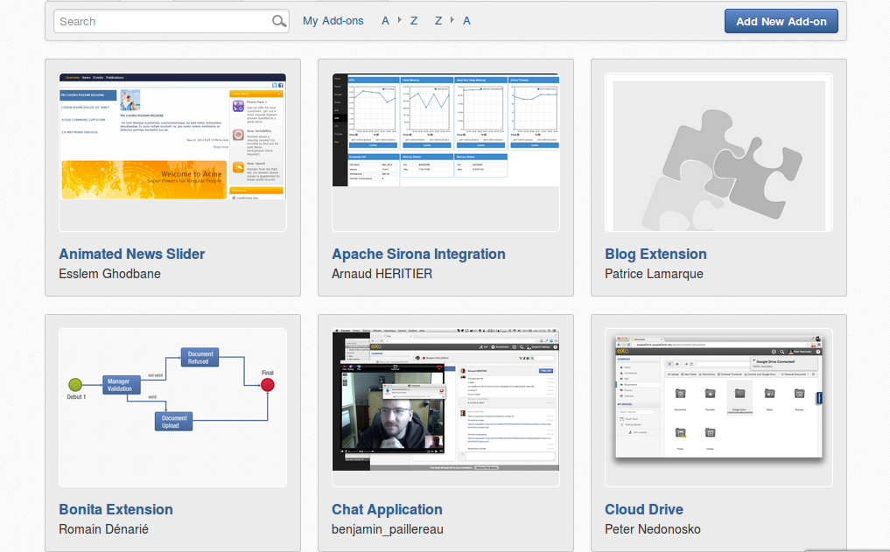
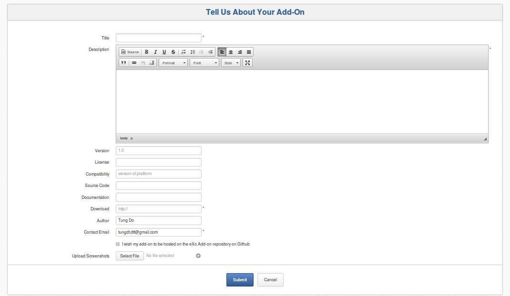
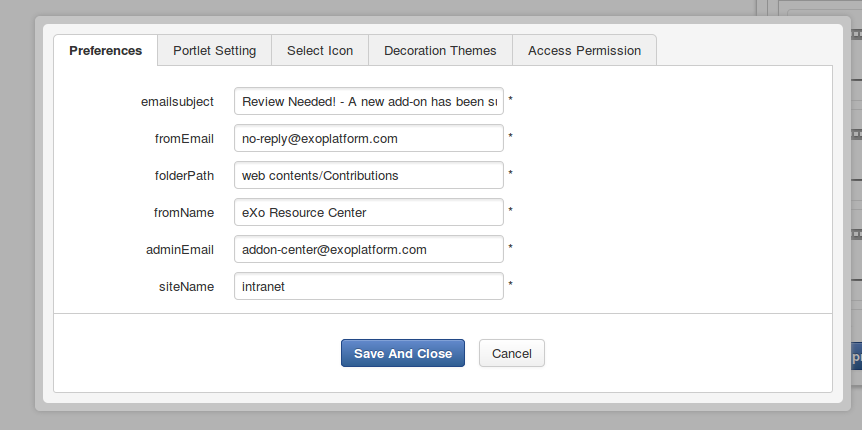

marketplace-extension
=====================

eXo Market Place extension to list and manage a list of add-ons.
* Market place home: list all add-ons, allow search, filter and sort

* Post new Add-on form:

* Add-on detail:

Build
---------------
Simply build it with :

	mvn clean install

Deploy to eXo
---------------
After build with this add-on:
* Copy file marketplace-extension/webapp/target/add-on-center-webapp.war into Platform-Tomcat/webapps
* Copy file marketplace-extension/lib/target/add-on-center-lib-1.0.x-SNAPSHOT.jar and marketplace-extension/config/target/add-on-center-config-1.0.x-SNAPSHOT.jar into Platform-Tomcat/lib
* Start tomcat.
* Note: three files above are also available in marketplace-extension/bundle/target/add-on-center-bundle-1.0.x-SNAPSHOT.zip

Configuration
---------------
This add-on allows set-up configuration to send notification emails to Administrator. These emails detail about add-on information just after submitted the addon.
This addon allows set-up place and site to store the data of add-ons. If you don't want to change it, you should keep them by default.
There are 2 ways to set-up this add-on:
* Update "AddOnPortlet" Portlet preference in file file add-on-center-webapp.war/WEB-INF/portlet.xml before starting tomcat
* After started tomat, go to Create New Addon page, edit this page, edit "AddOnPortlet" portlet preference: 
  
   
The configuration fields are: 
adminEmail: the Administrator email address will recevice notifications email. 
fromEmail: sender email address. 
fromName: email sender name. 
emailsubject: email subject. 
folderPath: place to store Add-ons data (you should keep it by default). 
siteName: Portal site to store Addons data (you should keep it by default).
